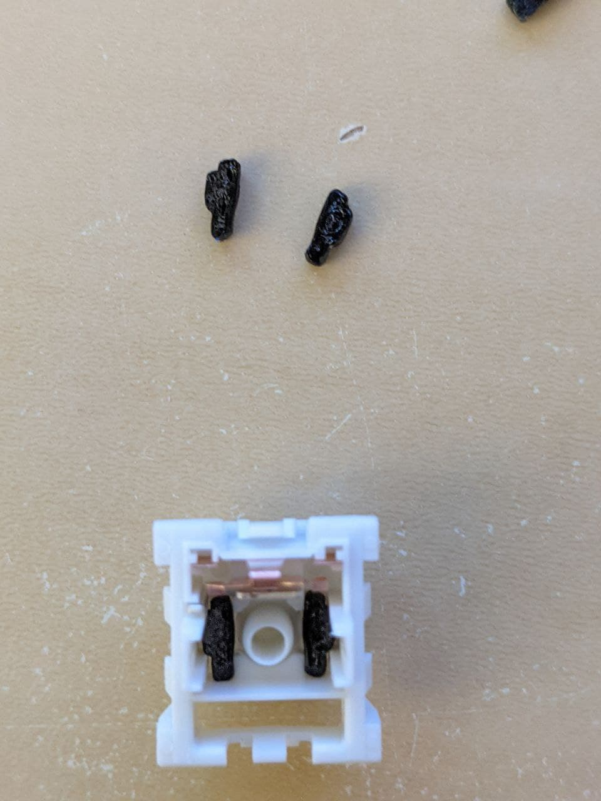
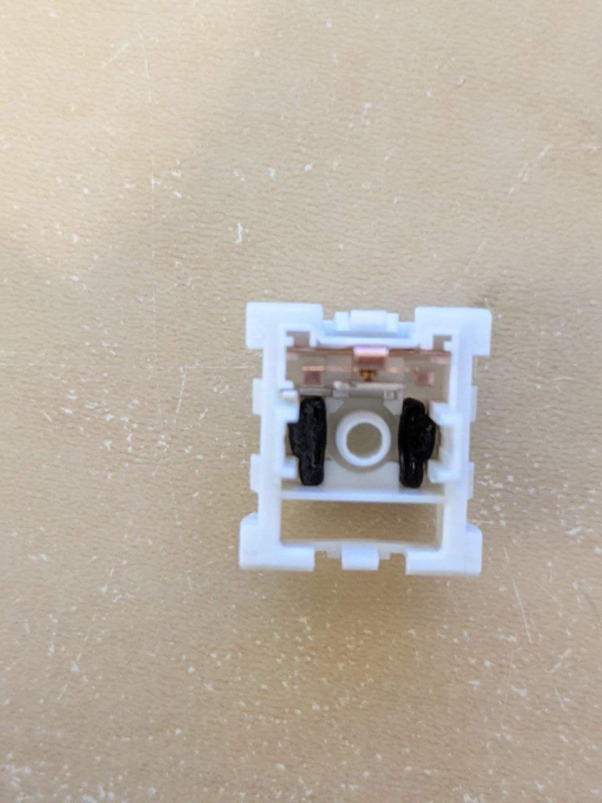

# MX Switch Travel Reduction Mod
Reduce travel distance for MX switches. So far tested on Kailh Speed Silvers and Gateron Clears (with different spacer heights).

This is a very simple parametric model for spacers which press-fit into a Kailh speed switch and limit the total travel distance. They are designed to be 3D printed out of TPU or similar so that they can squish enough to friction fit in place easily.

To tweak the travel distance you can adjust the `height` parameter in `switchmod.scad`. You will need to install [OpenSCAD](https://openscad.org/downloads.html#snapshots) (development snapshot recommended) and [BOSL](https://github.com/revarbat/BOSL). You can then open the .scad file in OpenSCAD, modify the parameters at the top as needed, render, and export as STL.

